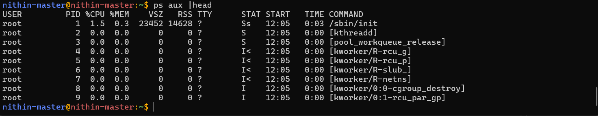
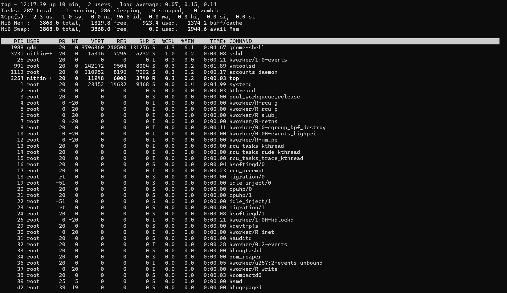
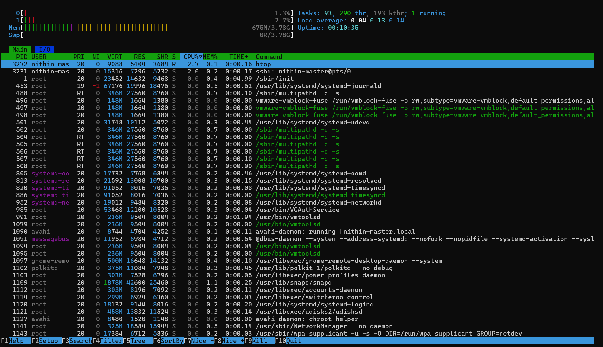

# Day 04 – Linux Practice: Processes and Services

## Task
Today’s goal is to **practice Linux fundamentals with real commands**.

### Check running processes
#### $ ps command with aux options
  
#### $top command to view running process
  
#### $htop similar to top htop makes interactive
  
### Inspect one systemd service
#### $ systemctl <service> get the service details
  
#### $ systemctl with list-units options
  
### Capture a small troubleshooting flow
#### $ tail command to display the last 10 logs
  
#### $ journal of the log with the timeframe value

  

## Why This Matters for DevOps
Hands‑on practice builds speed and confidence.

When issues happen in production, you won’t have time to search for basic commands.  
This day helps you build muscle memory with Linux fundamentals.

